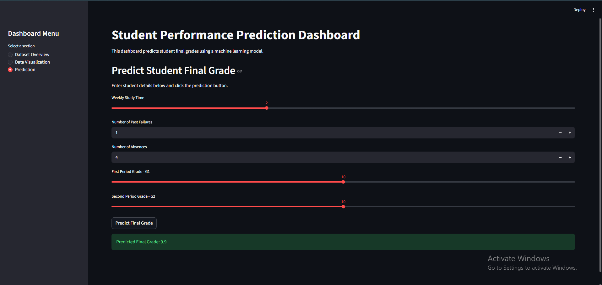

# Student Performance Prediction Dashboard

This project is a Streamlit dashboard that predicts student final grades using machine learning.

## Project Description

The main goal of this project is to create an interactive dashboard for predicting student final grades based on selected student-related features.

The dashboard uses a machine learning model to predict the final grade of a student using details such as weekly study time, past failures, absences, first period grade, and second period grade.

The target variable of this project is **G3**, which represents the final grade of the student.

## Technologies Used

- Python
- Streamlit
- Pandas
- Matplotlib
- Scikit-learn

## Dataset

The dataset used in this project is the **Student Performance Dataset**.

Important columns used in this project:

| Column | Description |

| studytime | Weekly study time |
| failures | Number of past class failures |
| absences | Number of school absences |
| G1 | First period grade |
| G2 | Second period grade |
| G3 | Final grade / target variable |

## Features

- Dataset overview
- Dataset preview
- Missing value checking
- Duplicate row checking
- Data visualization
- Machine learning model training
- Final grade prediction
- Actual vs predicted grade comparison
- Model evaluation using Mean Absolute Error

## Machine Learning Model

The machine learning model used in this project is:

**Random Forest Regressor**

Random Forest Regressor was selected because it is suitable for predicting numerical values. Since the final grade is a number, this model is appropriate for this project.

## Model Evaluation

The model was evaluated using **Mean Absolute Error**.

Mean Absolute Error shows the average difference between the actual final grades and the predicted final grades.

A lower Mean Absolute Error means the model predictions are closer to the actual values.

## Dashboard Pages

The dashboard contains three main sections:

### 1. Dataset Overview

This page shows:

- Number of students
- Number of columns
- Missing values
- Duplicate rows
- Dataset preview
- Model evaluation result

### 2. Data Visualization

This page shows charts such as:

- Study Time vs Final Grade
- Absences vs Final Grade
- G1 vs Final Grade
- G2 vs Final Grade
- Actual vs Predicted Grades

### 3. Prediction

This page allows users to enter student details and predict the final grade.

User inputs:

- Weekly study time
- Number of past failures
- Number of absences
- First period grade
- Second period grade

Output:

- Predicted final grade

## Dashboard Screenshots

### Dataset Overview


### Data Visualization


### Prediction Result



## How to Run the Project

1. Clone this repository.

```bash
git clone your-repository-link

2. Open the project folder.

cd Student-Performance-Prediction-Dashboard

3. Install required libraries.

pip install -r requirements.txt

4. Run the Streamlit app.

streamlit run app.py

5. Open the dashboard in your browser.

http://localhost:8501